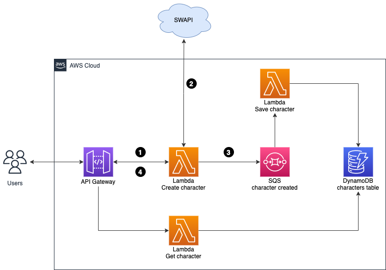
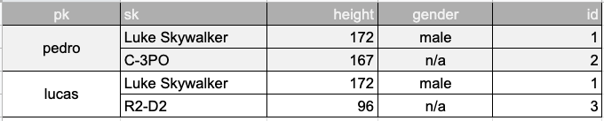

# Bem vindo ao StarWarks Serverless

Este projeto demonstra a utilização do CDK para provisionar o Lambda em Node/TypeScript e OpenAPI.

## Arquitetura




## Modelagem do DynamoDB



## Mock da SWAPI

A SWAPI pode ser mockada com o stubby4j, basta iniciar o docker-compose.yml.

````
docker-compose up -d
````

O arquivo `locals.json` possui o endereço local do stubby4j no docker.

No macOS no teste `invoke local` você deve usar o valor: http://host.docker.internal:8882, para que o container do SAM consiga chamar o host.

## Useful commands

 * `npm run build`   compile typescript to js
 * `npm run watch`   watch for changes and compile
 * `npm run test`    perform the jest unit tests
 * `cdk deploy`      deploy this stack to your default AWS account/region
 * `cdk diff`        compare deployed stack with current state
 * `cdk synth`       emits the synthesized CloudFormation template
